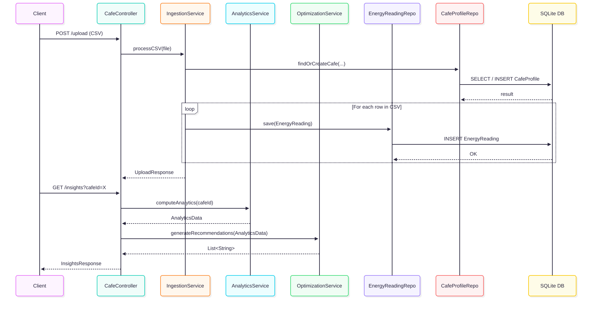

☕ London Café Energy Optimiser

⚡ The Problem
In the London hospitality scene, energy costs are usually the second biggest overhead after staff wages. Most café owners get a bill at the end of the month but have zero visibility into when they are actually burning that power. Peak usage hours can drive costs up massively and without granular data owners are just guessing where the money is going.

I built this system to bridge that gap. It transforms raw CSV meter data into actionable advice. Instead of just plotting a graph the system identifies specific load shifting opportunities: telling a manager exactly when to move high energy tasks like running the dishwasher or ice machine cycles to cheaper times of the day to save money.

📐 The Design Phase: Planning the Architecture

Before writing any code I started by mapping out the system requirements. I needed a way to handle high volumes of data while keeping the user interface responsive. I began by designing the System Architecture to define how the different components would interact:

From there I designed a UML Class Diagram to establish the relationship between the ingestion logic and the analytics services ensuring the code remained modular and easy to maintain:

🛠️ The Implementation: Why This Setup?

I built this system as a hybrid data pipeline and REST API setup to reflect how real-world, event-driven systems handle large-scale data. It efficiently processes thousands of energy readings while giving clients real-time access through a REST API.

Spring Batch for Processing

To handle large CSV uploads, I used Spring Batch. Processing thousands of meter readings at once can quickly overload memory, so I implemented a chunking strategy that processes 100 lines at a time. This approach keeps batch operations scalable and reliable.

MySQL 9.5 for Storage

The database is fully relational, making sure every energy reading links correctly to its café profile. A relational design keeps the data consistent and makes analytics and optimization queries straightforward.

REST API for Client Interaction

A Spring Boot REST API exposes endpoints for CSV uploads and analytics. The CafeController orchestrates requests between ingestion, optimization, and analytics services, keeping the API and business logic cleanly separated.

Business Services

IngestionService parses and stores raw readings

OptimizationService analyzes data for energy-saving recommendations

AnalyticsService aggregates insights for clients

Persistence Layer
Repositories like CafeProfileRepository and EnergyReadingRepository handle database access while Spring Data JPA manages interactions with MySQL.

This design makes the system scalable, maintainable, and ready to meet real-world operational demands.

Here is the Entity Relationship Diagram (ERD) I used to build out the database:

🔄 How Data Flows: The Sequence
To ensure the CSV ingestion was reliable I mapped out the Sequence Diagram. This helped me handle potential failures such as malformed CSV rows without crashing the entire upload process:

🤖 Strategic AI Collaboration

I used AI as a productivity tool to speed up the development process. It was particularly helpful for handling boilerplate tasks such as generating DTOs and setting up the initial Maven dependencies. This allowed me to spend more time on the core architecture and the complex SQL aggregations. It was also great for brainstorming edge cases for my unit tests like handling future timestamps or missing headers.

📝 Lessons Learnt and Tradeoffs

Data Lineage: One of the key things I learnt was the value of keeping raw data. I decided to store the CSV files locally even after processing. While deleting them saves space keeping them creates an audit trail for compliance and allows me to replay the data if I ever upgrade the processing logic later.

Accuracy vs Speed: I organised the database so that each café is only recorded once. This makes saving data a little slower, but it means all reports are completely accurate. For a financial tool, getting the numbers right is more important than speed.

🚀 Scalability and Future Improvements

To move this from a working prototype to a production grade system I have mapped out several key architectural upgrades:

Load Balancing and Horizontal Scaling: I would deploy multiple app instances behind a Load Balancer. This ensures the system stays available even if one server goes down allowing the app to scale as more cafés join the service.

Distributed Rate Limiting: To protect the system from being overwhelmed by too many simultaneous uploads I would implement a Rate Limiter. This ensures fair usage across all café accounts.

Database Sharding: As the volume of readings grows into the millions I would implement Sharding. By partitioning the data across multiple MySQL servers based on cafe id the system can maintain fast query speeds even with massive datasets.

Predictive Intelligence and Operations:

AI/ML Integration: Connecting the system to predictive models that can forecast high energy usage days based on weather and historical patterns. This would allow café owners to get early warnings and receive personalised suggestions to save energy, such as adjusting heating, cooling, or lighting. It’s a way to make the system smarter and help businesses cut costs while keeping customers comfortable.

Operations and Security: Adding a CI CD pipeline, Spring Security (OAuth2 JWT) for authentication and Prometheus for monitoring batch job health.

Enhanced Features: Expanding file support to JSON or Excel, adding geolocation from the UI for regional benchmarking and building out usage heatmaps.

📦 Quick Setup

Database: Create a MySQL schema called energy_optimiser.

Config: Update your credentials in src/main/resources/application.properties.

Run: Execute mvn spring-boot:run.

## 🚀 Try It Out

You can explore and test the API endpoints directly using the interactive Swagger UI:

👉 [Live Swagger UI](https://cafeenergyoptimiser.onrender.com/swagger-ui/index.html)

